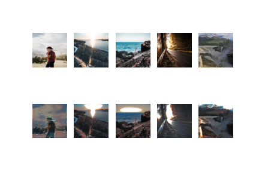
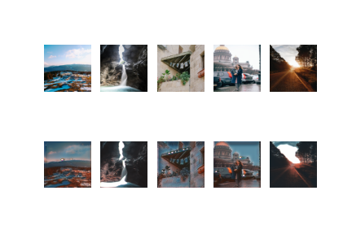

## Reference for Cyclce GAN

https://machinelearningmastery.com/cyclegan-tutorial-with-keras/
## Colab Link

https://colab.research.google.com/drive/1fkfMvygbXQwjlXfJji7Nx5BDZ6VEeY53?usp=sharing

## Epoch 2

### Day to Night images

### Night to Day images

## Epoch 3

### Day to Night images

### Night to Day images

## Epoch 4

### Day to Night images

### Night to Day images

## Epoch 5

### Day to Night images

### Night to Day images

## Model File trained for 5 epochs
> File name :  [g_model_AtoB_003405.h5](https://drive.google.com/file/d/1Oez6vjxjrD7iG4E-8oOj7CRJMC-CMZB_/view?usp=sharing) 

## Epoch 6

### Day to Night images

### Night to Day images

## Epoch 7

### Day to Night images

### Night to Day images

## Epoch 8

### Day to Night images

### Night to Day images

## Epoch 9

### Day to Night images

### Night to Day images

## Epoch 10

### Day to Night images

### Night to Day images

## Model File trained for 10 epochs

> File name :  [g_model_AtoB_006810.h5](https://drive.google.com/file/d/1bssJ2uUPZj7wJV1I9OtNpaaTcGpdEqYI/view?usp=sharing) 

